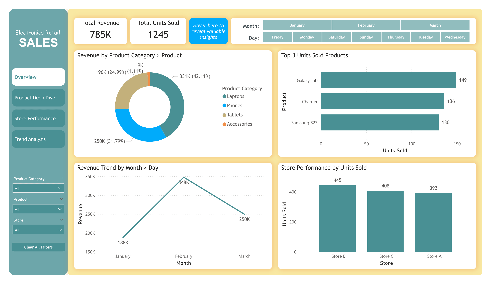
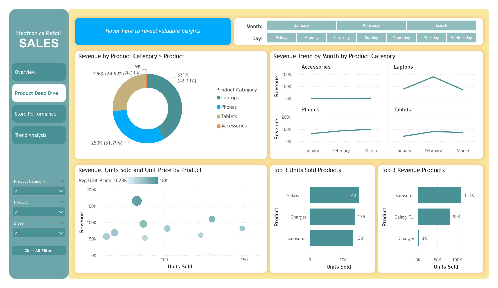
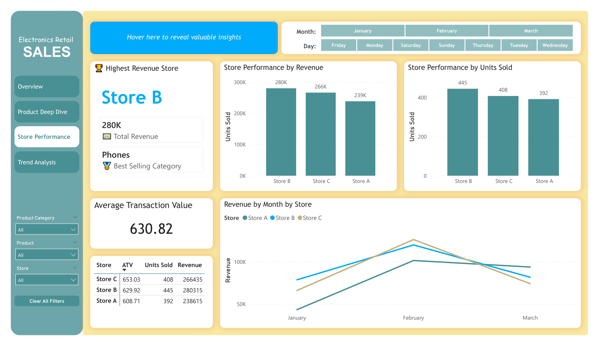
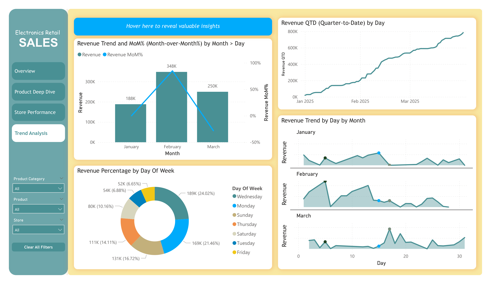

# Q1 2025 Business Performance Analysis Project (PowerBI)

---

## 📝 Project Overview

This project analyses the business performance of a retail company in Q1 2025 using Power BI.
The goal is to explore revenue trends, product performance, and store behaviour, and transform raw sales data into clear business insights through interactive dashboards and analytical reporting.

Key business questions addressed include:

1. What was the total revenue and overall trend in Q1 2025?
2. Which product categories and items generated the most revenue?
3. What were the best-selling products?
4. How did different stores perform in terms of volume and value?
5. What patterns can be observed across January, February, and March?

This project focuses on transforming raw sales data into clear business insights through interactive dashboards and structured analysis.

## 📁 Folder Structure
- [Q1-2025-Business-Analysis](./)
  - [data](./data)
    - [retail_sales_q1_2025_large.csv](./data/retail_sales_q1_2025_large.csv)
  - [reports](./reports)
    - [Tech Retail Sales Project.pbix](./reports/Tech%20Retail%20Sales%20Project.pbix)
    - [Tech Retail Sales Report.docx](./reports/Tech%20Retail%20Sales%20Report.docx)
  - [image](./image)
    - [dashboard_overview.png](./image/dashboard_overview.png)
    - [dashboard_product.png](./image/dashboard_product.png)
    - [dashboard_store.png](./image/dashboard_store.png)
    - [dashboard_trend.png](./image/dashboard_trend.png)
  - [LICENSE](./LICENSE)
  - [README.md](./README.md)

## 📊 Analysis Section

### 1️⃣ Overall Business Performance

Total revenue in Q1 2025: **$785K**

Revenue trend:

- January: slow and unstable
- February: sharp increase (peak month)
- March: sudden decline

The quarter showed strong growth but lacked consistency.

**Insight:**
Growth was driven by short-term spikes rather than steady daily performance.

### 2️⃣ Product Category Analysis

- Laptops generated the highest revenue (42.11%, $331K).
- Phones showed stable and reliable performance.
- Accessories sold high volumes but contributed less revenue due to low unit price.

**Key insight:**

High sales volume does not equal high revenue.

There was no single “superstar product” that achieved both high volume and high revenue, meaning the business relied on multiple products to drive results.

### 3️⃣ Store Performance Analysis

Each store showed a different performance pattern:

**Store B** – High Volume Store

- Highest number of units sold
- Strong customer traffic
- Core revenue driver

**Store C** – High Value Store

- Highest average transaction value
- Strong performance in February
- Sharp decline in March (high risk, high reward)

**Store A** – Stable Store

- Moderate performance
- Most resilient during March slowdown
- Showed recovery signs when others dropped

**Summary:**
Store B brings volume, Store C brings value, and Store A brings stability.

### 4️⃣ Time Trend & Momentum Analysis

- January: slow start with several low-sales days
- February: peak month with strong but volatile performance
- March: clear slowdown with partial recovery mid-month

The business relied heavily on February’s surge, which could not be sustained.

**Business Question for Q2:**
How to create consistent daily momentum instead of relying on short-term spikes?

### 5️⃣ Key Business Insights

1. Products with high unit sales are not always the most profitable.
2. Store performance varies by customer behaviour and risk level.
3. Revenue growth was driven by one strong month rather than stable trends.
4. A balanced strategy is needed:
- Volume (Store B)
- Value (Store C)
- Stability (Store A)

### ⚠️ Limitations

- The dataset only covers Q1 2025, so long-term seasonal trends cannot be identified.
- No customer demographic data (age, gender, loyalty level) is included.
- External factors such as promotions, marketing campaigns, or holidays are not provided.

**Future improvements could include:**

- Adding customer segmentation
- Including marketing or promotion data
- Extending analysis to multiple quarters

## 🔧 Tools

**1. Power BI Desktop**
- Data modelling
- Interactive dashboards
- DAX calculations

**2. DAX (Data Analysis Expressions)**
- Measures for revenue, units sold, and averages

**3. Microsoft Excel / CSV (Data Source)**
